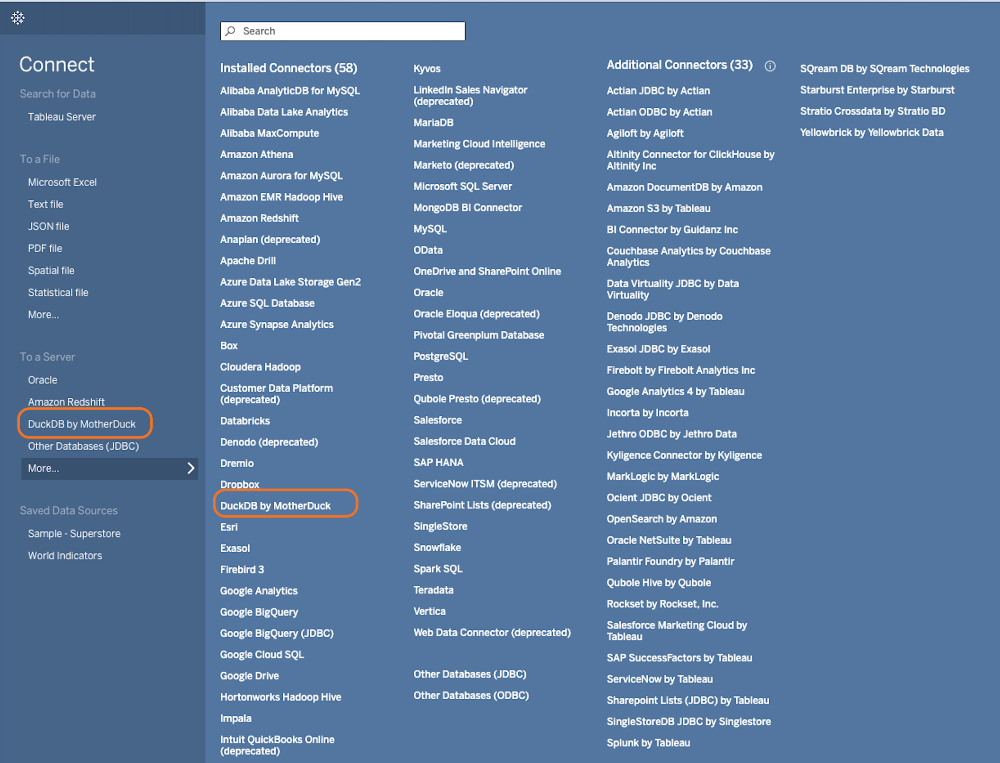
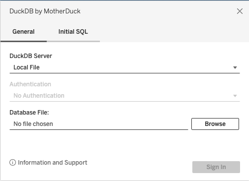
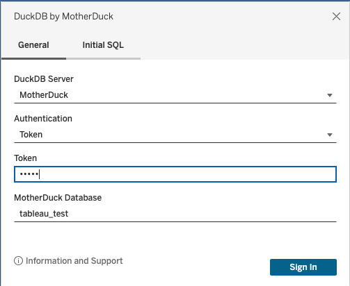
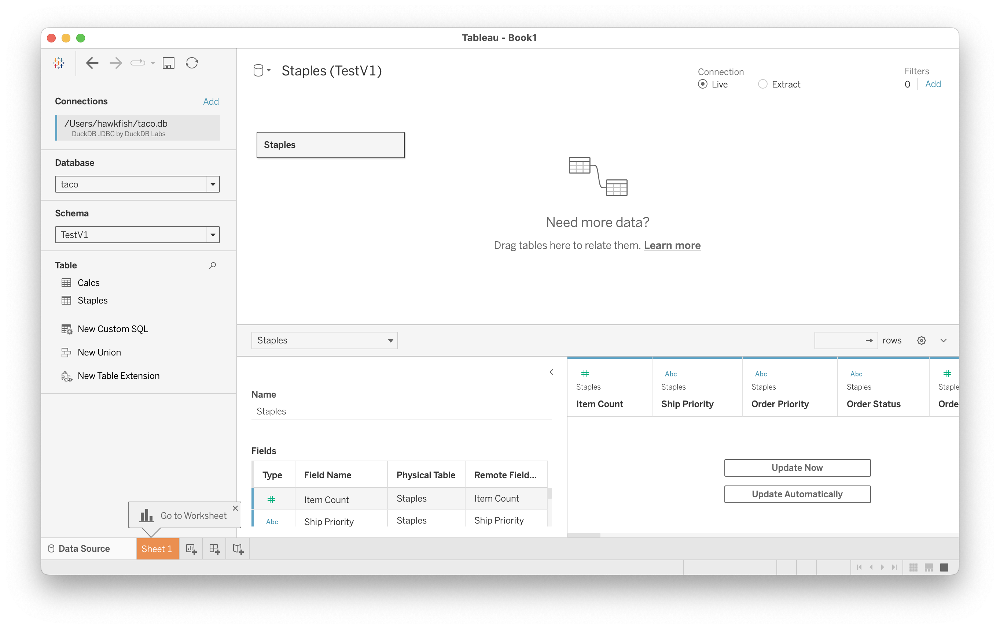

# duckdb-taco - A Tableau Connector for DuckDB

This connector allows Tableau integration with local DuckDB files, in-memory DuckDB databases and MotherDuck!
It has been fully tested against the Tableau dialect generator.

Please file any connectivity problems as bugs against this repository and not against DuckDB.

## Compatibility

The connector works with DuckDB JDBC driver v0.9.2 or higher.

## Installation

1. Download a [recent version of the driver](https://github.com/duckdb/duckdb/releases) and [copy it into the Tableau Drivers directory](https://tableau.github.io/connector-plugin-sdk/docs/drivers#jdbc-driver-class-isolation):
   * Desktop Windows: `C:\Users\[YourUser]\Documents\My Tableau Repository\Drivers`
   * Desktop MacOS: `/Users/[YourUser]/Documents/My Tableau Repository/Drivers`
   * Server Windows: `C:\ProgramData\Tableau\Tableau Server\data\tabsvc\vizqlserver\Drivers`
   * Server Linux: `[Your Tableau Server Install Directory]/data/tabsvc/vizqlserver/Drivers`

2. Download the signed tableau connector (aka "Taco file") file from the [latest available release](https://github.com/MotherDuck-Open-Source/duckdb-tableau-connector/releases) and copy it into the Connectors directory:
   * Desktop Windows: `C:\Users\[YourUser]\Documents\My Tableau Repository\Connectors`
   * Desktop MacOS: `/Users/[YourUser]/Documents/My Tableau Repository/Connectors`
   * Server Windows: `C:\ProgramData\Tableau\Tableau Server\data\tabsvc\vizqlserver\Connectors`
   * Server Linux: `[Your Tableau Server Install Directory]/data/tabsvc/vizqlserver/Connectors`

## Connecting

NOTE: for v0.8.1 or earlier, see the archived [connection documentation](./docs/connecting_pre_1.0.md).

Once the Taco is installed, and you have launched Tableau, you can create a new connection by choosing "DuckDB by MotherDuck":



### Local file

If you wish to connect to a local file, select "Local file" as DuckDB Server option, and use the file picker:




### In-Memory Database

The driver can be used with an in-memory database by selecting the `In-memory database` DuckDB Server option.
The data will then need to be provided by an Initial SQL string e.g.,

```sql
CREATE VIEW my_parquet AS
    SELECT *
    FROM read_parquet('/path/to/file/my_file.parquet');
```

You can then access it by using the Tableau Data Source editing controls.


## MotherDuck

To connect to MotherDuck, you have two authentication options:
* Token -- provide the value that you [get from MotherDuck UI](https://motherduck.com/docs/authenticating-to-motherduck#fetching-the-service-token).
* No Authentication -- unless `motherduck_token` environment variable is available to Tableau at startup, you will then be prompted to authenticate when at connection time.

To work with a MotherDuck database in Tableau, you have to provide the database to use when issuing queries.
In `MotherDuck Database` field, provide the name of your database. You don't have to prefix it with `md:`:


## Using

Once connected, you can use the Tableau connection window to choose schemas, join tables,
and perform all the basic data cleaning operations it provides for creating a data source:



Note that DuckDB has a three-level naming system (`database.schema.table`) so you will need to select the database (instead of `system` or `temp`).

### Initial SQL

Tableau allows connections to run initial SQL.
This feature can be used to make sure that various settings are correct:


## Connecting to external data

One of the most powerful uses of DuckDB files is not to access data stored in the file, but to query data in other file formats.
To do this, use the database file to store views of the external files.
For example, you can create a `VIEW` of a directory of Hive-partitioned parquet files.
Or, you can use it to perform fast analytics on a SQLite file.
