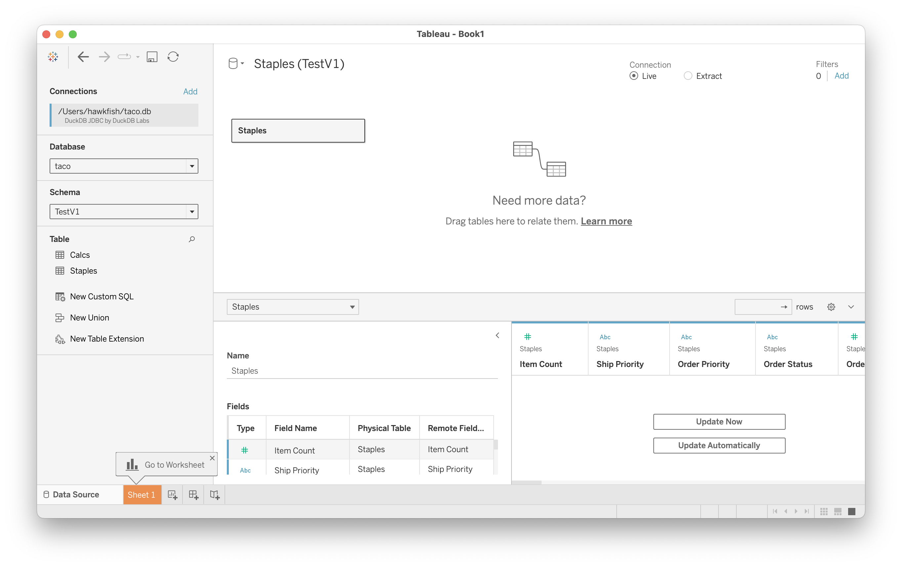

## Connecting (v0.8.1 or earlier)

Once the Taco is installed and you have launched Tableau,
you can create a new connection by choosing "DuckDB by MotherDuck":

DuckDB is a file-based database, so the connection dialogue simply asks for a file:

Because the engine is embedded in the driver itself,
you need to make sure that the JDBC driver uses the same database version as was used to create the database file.

Once connected, you can use the Tableau connection window to choose schemas, join tables,
and perform all the basic data cleaning operations it provides for creating a data source:

Note that DuckDB has a three-level naming system (`database.schema.table`)
so you will need to select the database for the file (instead of `system` or `temp`).